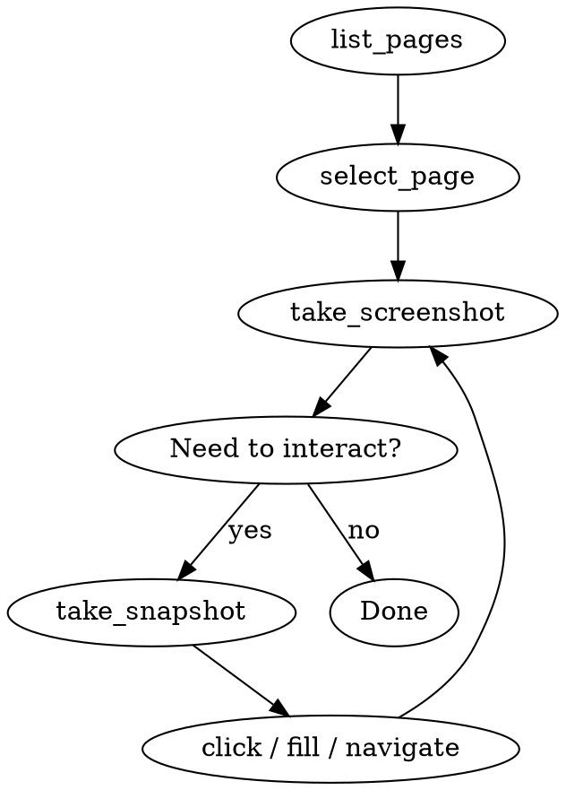

# Browser Control

## Overview

Control the user's Chrome browser directly via Chrome DevTools MCP tools. Requires Chrome 144+ with Remote Debugging enabled at `chrome://inspect/#remote-debugging`.

## Core Workflow

## Quick Reference

| Goal | Tool |
|------|------|
| List open tabs | `mcp__chrome-devtools__list_pages` |
| Switch to tab | `mcp__chrome-devtools__select_page` (pageId + bringToFront: true) |
| See current state | `mcp__chrome-devtools__take_screenshot` |
| Get element UIDs | `mcp__chrome-devtools__take_snapshot` |
| Click element | `mcp__chrome-devtools__click` (requires uid from snapshot) |
| Fill input | `mcp__chrome-devtools__fill` (requires uid) |
| Navigate to URL | `mcp__chrome-devtools__navigate_page` |
| Run JavaScript | `mcp__chrome-devtools__evaluate_script` |

## Common Mistakes

| Mistake | Fix |
|---------|-----|
| Clicking without snapshot | Always call `take_snapshot` first to get uid |
| Assuming pageId = index | Verify with `list_pages`, use the number shown |
| Not confirming action worked | Always screenshot after click/fill |
| Connection lost error | Ask user to restart Claude Code |
